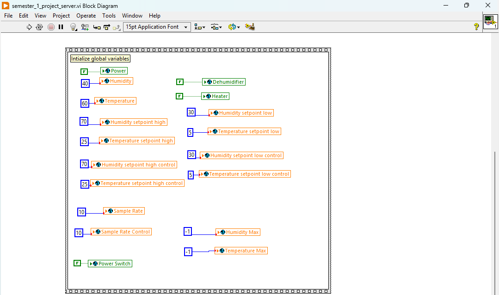
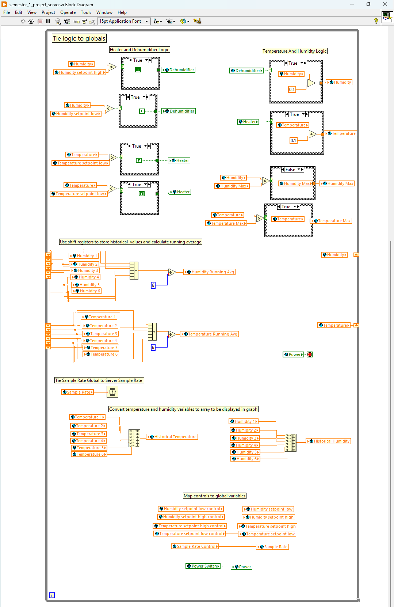
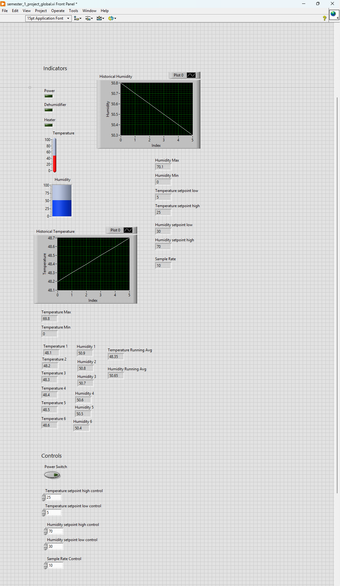
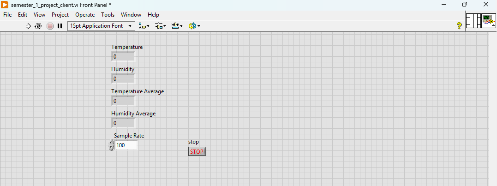
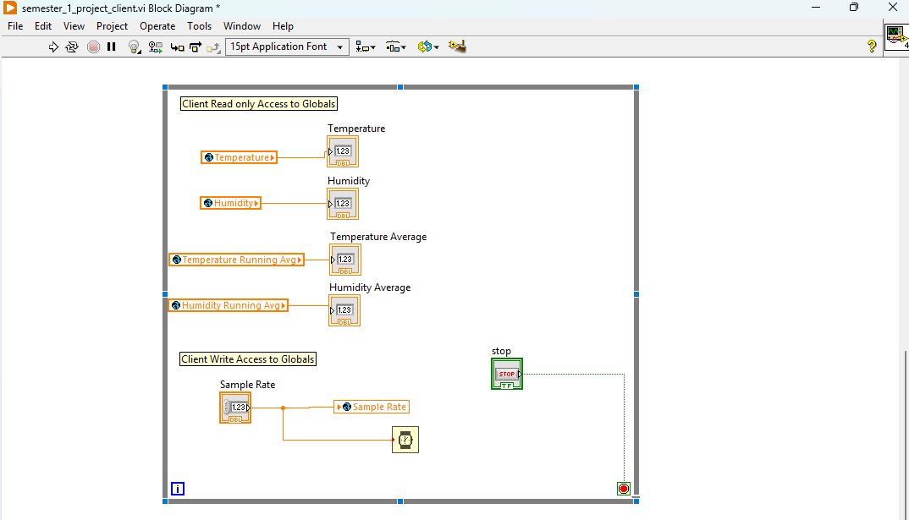

# scada-labview-climate-control

SCADA Air Conditioning Temperature and Humidity. LabVIEW Server &amp; Client Vis using Global Variables

## Overview

In modern climate control systems, maintaining optimal temperature and humidity is essential
for ensuring comfort and preserving sensitive environments.  
This project aims to simulate a
thermal and humidity control system using LabVIEW.  
The system will monitor ambient temperature and humidity values, process simulated sensor
signals, and regulate environmental conditions by activating a heater or dehumidifier when
values deviate from the desired range.  
The implementation involves three Virtual Instruments (VIs):
- Server VI which implements environment and machine logic
- Global VI for storing, viewing and controlling variables
- Client VI for more limited viewing and controlling
By utilizing global variables and various LabVIEW structures, the system ensures efficient data
sharing, synchronized operation.  
The main objectives of this project are:  
- Develop a Server VI to simulate and control temperature and humidity.
- Implement automatic heater and dehumidifier activation based on setpoint thresholds.
- Display real-time and historical temperature and humidity data, along with system status.
- Create a Client VI for read-only access to data and synchronized sample rate control.
- Ensure smooth data processing using running averages and realistic signal simulations

## How it works

There are three parts to this LabVIEW System.
- The Server Virtual Instrument:
    - semester_1_project_server.vi
- The Global Virtual Instrument:
    - semester_1_project_global.vi
- The Client Virtual Instrument:
    - semester_1_project_client.vi

## The Server Virtual Instrument
The Server Virtual Instrument handles the core operating logic of the system.  
This includes the temperature and humidity simulation along with the heater and dehumidifier
system.  
All states are stored where possible in global variables located within the external Global Virtual
Instrument including controls:  
- Humidity
- Temperature
- Dehumidifier
- Heater
- Humidity setpoint high
- Humidity setpoint low
- Temperature setpoint high
- Temperature setpoint low
- Humidity setpoint high control
- Humidity setpoint low control
- Temperature setpoint high control
- Temperature setpoint low control
- Sample Rate
- Sample Rate Control
- Humidity Max
- Temperature Max
- Power
- Power Control
There is nothing contained within the Server Front Panel.  
The Server initializes all state in the program where possible within a Flat Sequence Structure
outside of the main loop of execution.  
This allows for variables to be initially set with default values within the program before the run
time loop.  

#### Server Virtual Instrument Block Diagram Screenshot Part 1

#### Server Virtual Instrument Block Diagram Screenshot Part 2

### Heater and Dehumidifier On\Off Logic
Within the main loop of execution (While Loop) we have the Heater and Dehumidifier logic.  
This involves reading from the Measurement and setpoint variables.  
The output is then fed into a comparison that outputs a true/false result into a Case Structure.  
The Case Structure allows us to keep the value the same for one case and override it for the other.  
The output of the Case Structure will update the global value for the specific system to turn it on or off.  
This general logic is repeated for each use case:
- If Humidity is greater than the Humidity setpoint high the Dehumidifier will be turned
On
- If Humidity is not greater than the Humidity setpoint high the Dehumidifier state will be
kept the same
- If Humidity is greater than the Humidity setpoint low the Dehumidifier state will be kept
the same
- If Humidity is less than the Humidity setpoint low the Dehumidifier will be turned Off
- If Temperature is greater than the Temperature setpoint high the Heater will be turned
Off
- If Temperature is not greater than the Temperature setpoint high the Heater state will be
kept the same
- If Temperature is greater than the Temperature setpoint low the Heater state will be kept
the same
- If Temperature is less than the Temperature setpoint low the Heater will be turned On

### Temperature and Humidity Simulation Logic
To Simulate the Signals, we feed the System power status into a Case Structure within the main loop of execution (While Loop).  
Based on whether the System is on or off 0.1 will be either added or removed from the signal.  
For each use case:  

- If the Dehumidifier is on, we decrease the humidity
- If the Dehumidifier is off, we increase the humidity
- If the Heater is on, we increase the temperature
- If the Heater is off, we decrease the temperature

### Max Temperature and Humidity Logic

For both signals we initialize the max value to -1 with in the Flat Sequence Structure outside of
the main loop.  

Within the main loop we feed each signal into a Case Structure that updates the max value if the
signal is greater than it.  

### Temperature and Humidity Running Average Logic

Within the main loop we leverage shift registers to store the last 6 Signal Measurements.  

We then feed all the values into a Compound Arithmetic operator to sum the values.  

The Sum is then divided by the count which is 6 to derive the average value.  

This is done for both Humidity and Temperature.  

### Temperature and Humidity Historical Values Logic

Within the main loop we leverage shift registers to store the last 6 Signal Measurements.  
These 6 Signal Measurements are stored in global variables and fed into a Build Array operator
to create a 1D array.  
This 1D array is fed into a graph.  
This is done for both Humidity and Temperature.  

### Universal Sample Rate Logic

We simply feed our Sample Rate global variable into the Wait (ms) operator.  

## The Global Virtual Instrument

The Global Virtual Instrument is where all the data is stored.  
It is where the main indicators are implemented:  
- Power on/off
- Heater status
- Dehumidifier status
- Current temperature reading
- Current humidity reading
- Running average of last 6 above readings
- Historical temperature reading (Chart)
- Historical humidity reading (Chart)
- Max reading
- Min reading
It is also where the main controls are implemented:
- Power on/off
- Temperature setpoint control low
- Temperature setpoint control high
- Humidity setpoint control low
- Humidity setpoint control high
- Sample Rate

This virtual instrument is quite simple.  
It only contains a Front Panel, there is no Block Diagram.  
All logic is located within the Server Virtual Instrument.  

#### Global Virtual Instrument Front Panel Screenshot

## The Client Virtual Instrument

The Client Virtual Instrument is where the limited indicators and controls are implemented.  
The limited indicators implemented are:  
- Temperature
- Humidity
- Temperature Average
- Humidity Average

The limited controls implemented are:  
- Sample Rate

This virtual instrument is quite simple. The values of Global variables are read from and written
to local indicators.  

The Sample Rate Control updates the Wait (ms) operator within the Client While Loop and also updates the Sample Rate Global Variable so that the local Wait (ms) operator is set within the Server VI.  

#### Client Virtual Instrument Front Panel and Block Diagram Screenshot

## SOFTWARE TOOLS

### While Loop

A While Loop in LabVIEW is a fundamental programming structure that repeatedly executes a block of code (the code inside the loop) as long as a specified condition is true.  

We use While Loops in our Server and Client VIs to continuously run/update the simulations, systems, indicators and controls.  

### Shift Registers

Shift Registers are used to store data across multiple iterations of a loop, such as a While Loop or a For Loop.  
They are a very useful tool for preserving values from one iteration of the loop to the next, allowing you to pass information along with each loop cycle.  

We use Shift Registers in our Server VI to store the historical values of both Humidity and Temperature.  

### Case Structures

Case Structures allow you to implement conditional logic in your programs, where different code paths are executed based on specific conditions or input values.  

We use Case Structures throughout our Server VI.  

Our main use case for them is to implement if else like functionality.  

For Example, we can make it so a value is only updated if a conditional is True.  

This can be seen in our:  
- Heater and Dehumidifier On\Off Logic
- Temperature and Humidity Simulation Logic
- Max Temperature and Humidity Logic

OPERATING PROCEDURES
First a user must open all panels:
- Server Back Panel
- Client Front Panel
- Client Back Panel
- Global Front Panel
They must then start the Server by clicking the Run arrow in the upper left side of the window.
They must then start the Client by clicking the Run arrow in the upper left side of the window.
The initial state of the program will be:
- Both the Dehumidifier and Heater will be off
- Humidity will be 40
- Humidity low point will be 30
- Humidity high point will be 70
- Temperature will be 60
- Temperature low point will be 5
- Temperature high point will be 25
- Sample Rate will be 10

From both the Client and Global Front Panel you will start to see indicators being updated with new data.  
The values shared between the Client and the Global Front Panel will stay in sync throughout the duration of the program.  

The temperature will begin to drop all the way down to 5 degrees Celsius at which point the heater will turn on causing the temperature to go up.  
Once the temperature reaches 25 the heater will turn off.  
The temperature will then bounce between 5 and 25 degrees.  

The humidity will begin to increase all the way up to 70% at which point the dehumidifier will turn on causing the humidity to go down.  
Once the humidity reaches 30% the dehumidifier will turn off.  
The humidity will then bounce between 30% and 70%.  

A user can change the low and high point of each to get different results.

From the Client the user can increase or decrease the Sample rate this will slow down/ speed up the main while loop of both the Client and the Server.  

## RESULTS/CONCLUSIONS

<u>Develop a Server VI to simulate temperature and humidity</u>  

A Server VI was successfully designed and implemented to simulate temperature and humidity conditions. The simulation incorporated Heater and Dehumidifier status to influence the simulated values. This provided realistic simulation behavior.  

<u>Implement automatic heater and dehumidifier activation based on setpoint thresholds</u>  
Automatic activation of the heater and dehumidifier based on configurable setpoint thresholds was successfully implemented. Both the Heater and Dehumidifier turn On/Off when set points are reached by their respective signals.  

<u>Display real-time indicators and controls</u>  
Real-time indicators and controls were developed to display control all the necessary system metrics listed in the brief. These indicators are user-friendly, real time, and provide a clear and interactive interface to monitor system behavior effectively.  

<u>Create a Client VI for read-only access to data and synchronized sample rate control</u>
The Client VI was created to allow read-only access to data from the Server VI.
The Client VI operated with synchronized sample rate control, ensuring consistent and accurate
data visualization between it and the Server.
This functionality enables remote monitoring and visualization of system metrics without
interfering with the control processes managed by the Server VI.